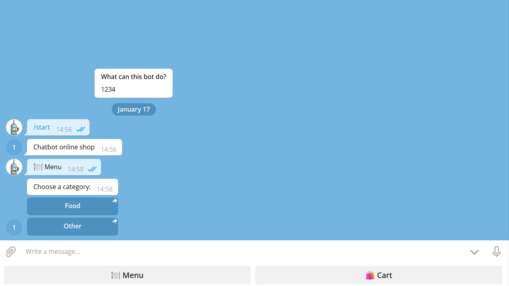
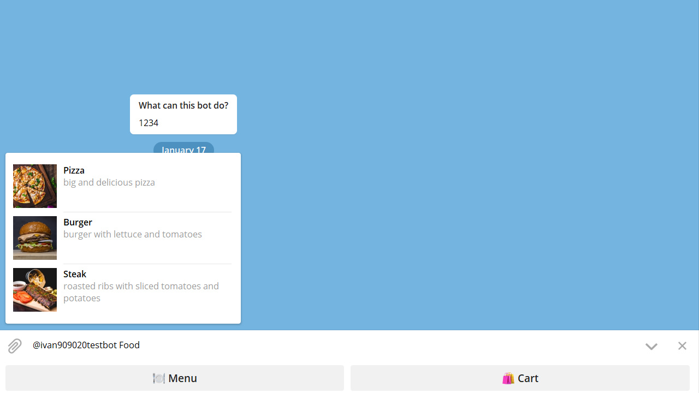
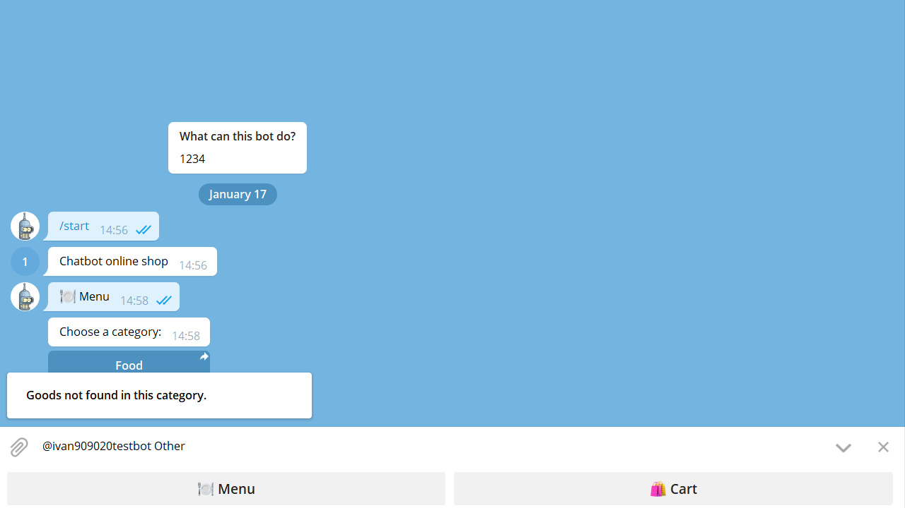
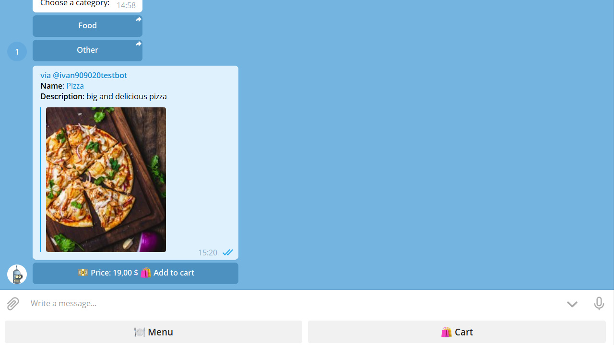
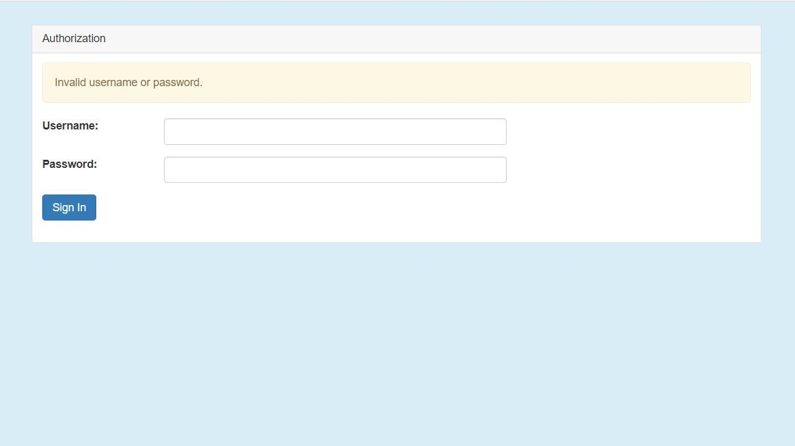
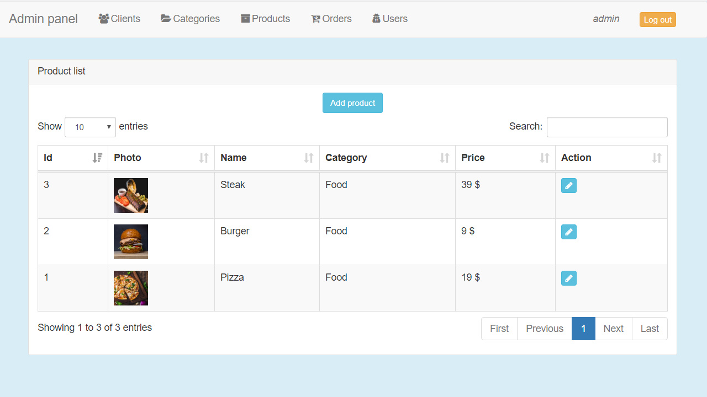
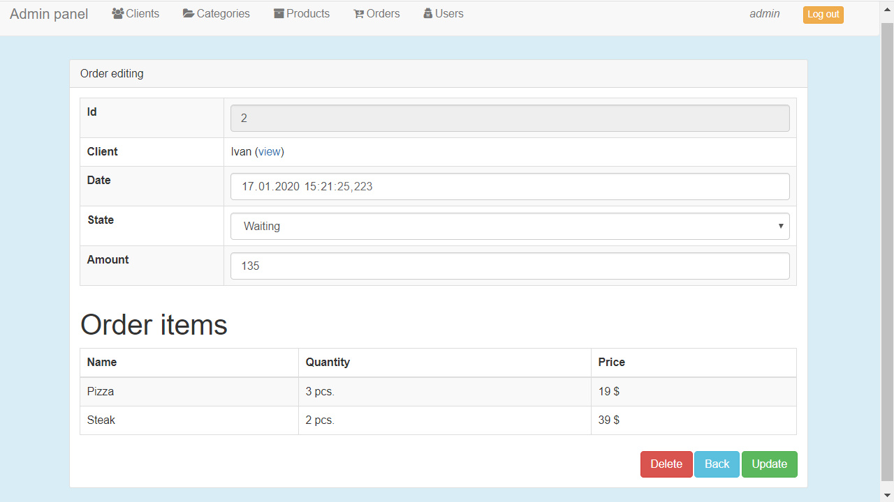
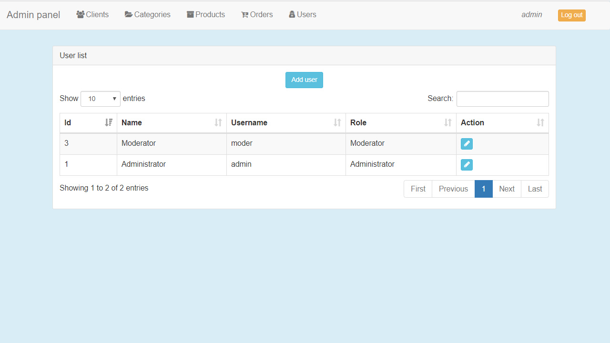

# shop-telegram-bot
Shop in the telegram with the admin panel

## Technology stack
Java 8, Maven, Spring Boot, Spring MVC, Spring Data, Spring Security, Postgresql, Freemarker, HTML, Telegram Bots, Hibernate

## Quick start guide
1. Create a database, import `db_schema.sql` and `db_data.sql`
2. Change the fields in the properties `telegram-bot/src/main/resources/application.properties` and `admin-panel/src/main/resources/application.properties`
3. Run the admin-panel and telegram-bot, web UI is accessible on `http://localhost:8080`

## Screenshots
#### Chatbot

#### Admin panel

